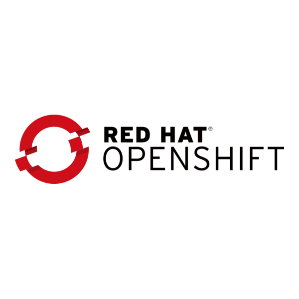

# OpenShift Discovery Plan

> **Document status:** Draft  
> **Last updated:** 2026-01-13  
> **Owner:** <name / team>  
> **Audience:** Platform Engineering, Networking, Security, App Teams

---

## 1. Purpose

This document captures the discovery inputs required to design, deploy, and operate an OpenShift platform in a consistent and supportable way.

**Goals**
- Establish a shared understanding of current-state infrastructure and constraints
- Identify dependencies, owners, and points of contact
- Reduce delivery risk by surfacing unknowns early

**Non-goals**
- Detailed implementation runbooks (tracked separately)
- Application-by-application migration plan (linked in Appendix)

---

## 2. Scope

**In scope**
- Platform topology (on-prem / cloud / hybrid)
- Network and DNS design inputs
- Hardware and ownership
- Restricted networks and external connectivity
- Supporting tools (CI/CD, registry, version control)

**Out of scope**
- End-user training
- FinOps cost optimisation beyond initial sizing

---

## 3. Current State Summary

| Area | Current state | Notes / gaps |
|---|---|---|
| Compute | <VMware / bare metal / cloud> | <e.g., lifecycle constraints> |
| Storage | <SAN / ODF / cloud disks> | <IOPS targets?> |
| Network | <VLANs / SDN / firewall model> | <segmentation model?> |
| Identity | <AD / LDAP / OIDC> | <group strategy?> |
| Monitoring | <Prometheus / Splunk / etc> | <ownership?> |

---

## 4. Platform Topology

### 4.1 Environments
- **Dev:** 

- **Test:** 

- **Prod:** 

### 4.2 Cluster count and purpose
- Cluster 1: <name> — <purpose>
- Cluster 2: <name> — <purpose>

### 4.3 Availability targets
- Control plane: <HA requirement>
- Worker pools: <zones / racks / failure domains>
- RTO/RPO: <values>

---

## 5. Networking

### 5.1 Network overview
- **Pod CIDR:** `<x.x.x.x/xx>`
- **Service CIDR:** `<x.x.x.x/xx>`
- **Machine network(s):** `<x.x.x.x/xx>`
- **Egress model:** `<NAT / proxies / direct>`
- **Ingress model:** `<routes / LB / WAF>`

### 5.2 Firewalls and segmentation
- Key north/south boundaries: <list>
- East/west restrictions: <list>
- Required openings (initial):  
  - `<src>` → `<dst>` : `<ports/protocols>` : `<reason>`

### 5.3 Load balancers
- API LB: <type/vendor>, VIP: <x.x.x.x>
- Ingress LB: <type/vendor>, VIPs: <x.x.x.x>
- Health-check method: <HTTP/TCP>, endpoints: 

### 5.4 VPNs, Private Links, and Data Center Interconnects
- VPNs in use: 

- Private links: <AWS/Azure/GCP private endpoints, etc.>
- DCI: <MPLS / dark fiber / express route>, bandwidth: <value>, latency: <value>
- Routing responsibility: <team>

---

## 6. DNS

### 6.1 Local domains
- Cluster base domain: `<apps.example.internal>`
- Corporate internal domain(s): `<example.internal>`, `<corp.example.com>`

### 6.2 Name servers
**Authoritative DNS**
- Primary: `<ns1.example.internal>` — Owner: <team/contact>
- Secondary: `<ns2.example.internal>` — Owner: <team/contact>

**Recursive DNS**
- Resolver 1: `<resolver1.example.internal>` — Owner: <team/contact>
- Resolver 2: `<resolver2.example.internal>` — Owner: <team/contact>

### 6.3 Records required (examples)
- `api.<cluster>.<domain>` → `<vip>`
- `api-int.<cluster>.<domain>` → `<vip>`
- `*.apps.<cluster>.<domain>` → `<ingress vip>`

---

## 7. Restricted Networks and External Connectivity

### 7.1 Restricted network definition
- Internet access from cluster nodes: `<none / limited / via proxy>`
- Allowed outbound destinations: <list>
- TLS inspection: `<yes/no>`, exceptions: <list>

### 7.2 External bridges / cloud connectivity
- Bridge to **Microsoft Azure** (for ARO / hybrid):  
  - Connectivity type: `<ExpressRoute / VPN / Peering>`
  - Egress points: `
`
  - Constraints: `<e.g., no public endpoints>`

### 7.3 Proxy configuration (if applicable)
- HTTP proxy: `<http://proxy:port>`
- HTTPS proxy: `<http://proxy:port>`
- No-proxy: `<.cluster.local,.internal,10.0.0.0/8,...>`

---

## 8. Hardware Details

> Include what is deployed, how it’s configured, and who to contact.

### 8.1 Inventory
| Component | Qty | Model / SKU | Location | Lifecycle | Notes |
|---|---:|---|---|---|---|
| Control plane nodes | <n> | <model> | <dc/rack> | <date> | <notes> |
| Worker nodes | <n> | <model> | <dc/rack> | <date> | <notes> |
| Storage | <n> | <model> | <dc/rack> | <date> | <notes> |

### 8.2 Configuration standards
- BIOS/firmware baseline: 

- NIC bonding/VLAN model: 

- Time sync (NTP): <servers>
- Out-of-band access: <iDRAC/iLO>, network: 

### 8.3 Points of contact
- Hardware operations: <name/team>, <email/handle>
- Data center: <name/team>, <email/handle>

---

## 9. Ownership and Contacts

| Area | Owner team | Primary contact | Backup contact |
|---|---|---|---|
| Red Hat software (OpenShift) | <team> | <name> | <name> |
| Networking | <team> | <name> | <name> |
| Hardware | <team> | <name> | <name> |
| Security | <team> | <name> | <name> |
| Identity | <team> | <name> | <name> |

---

## 10. Ancillary Services

### 10.1 Version control
- System: <GitHub/GitLab/Bitbucket>
- Org/project structure: 

- Access model: <SSO/groups>

### 10.2 CI/CD
- Tools: <Jenkins / GitHub Actions / Tekton / Argo CD>
- Promotion strategy: <dev→test→prod>
- Secrets management: <Vault / KMS / sealed secrets>

### 10.3 Container registry
- Registry: <Quay / Artifactory / ACR / ECR>
- Image scanning: <Clair/Trivy/etc>
- Retention policy: <days/tags>

---

## 11. Risks and Open Questions

**Top risks**
1. <risk> — Impact: <H/M/L> — Mitigation: <plan>
2. <risk> — Impact: <H/M/L> — Mitigation: <plan>

**Open questions**
- [ ] <question>
- [ ] <question>

---

## 12. Decisions Log

| Date | Decision | Rationale | Owner |
|---|---|---|---|
| 2026-01-13 | <decision> | <why> | <name> |

---

## 13. Next Steps

- [ ] Confirm network CIDRs and firewall openings
- [ ] Validate DNS ownership and required records
- [ ] Finalise hardware sizing and lifecycle constraints
- [ ] Confirm ancillary tooling integration approach
- [ ] Schedule design review and sign-off

---

## Appendix A: Links

- Architecture diagram: <link>
- Firewall request tracker: <link>
- Hardware inventory source: <link>
- CI/CD standards: <link>

